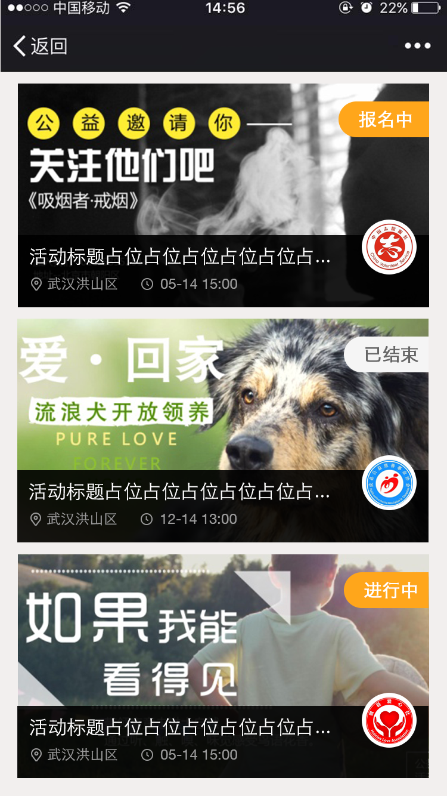

# 启动APP
## 尝试启动APP，有则启动，没有则跳转到应用市场
### ios环境下，微信和qq内置浏览器、自带的safair不能唤醒APP，只能跳转到appstore,其他浏览器可以唤醒；
### 安卓可以通过跳转应用宝市场唤醒APP，任何浏览器都可以唤醒,苹果则不行；
#### （坑）七牛获取的图片地址，不带后缀jpg或png的图片，在安卓微信浏览器不能正常显示，苹果则可以

           function openApp(){
        //  var schemeUrl = 'app里即有的协议如：  apps custom url schemes ';
        var data = {"type":"Normal","relatId":"8","title":"","content":"","remark":""};
        var schemeUrl = "cnaisin://?data="+JSON.stringify(data);
        if (navigator.userAgent.match(/(iPhone|iPod|iPad)/i)) {
            var loadDateTime = new Date();
            window.setTimeout(function() {
                var timeOutDateTime = new Date();
                if (timeOutDateTime - loadDateTime > 5000) {

                } else {
                    window.location.href = "itms-apps://itunes.apple.com/app/id1190774356";
                }
            },25);
            window.location.href = schemeUrl;
        } else if (navigator.userAgent.match(/android/i)) {
            var state = null;
            try {
                state = window.open(schemeUrl, '_self');
            } catch(e) {}
            if (state) {
            } else {
                window.location.href="http://a.app.qq.com/o/simple.jsp?pkgname=com.cnaisin.axgy"
            }
        }
    }
    //判断用户设备是pc还是移动  pc时候点击打开app 跳转到官网 里面都附有下载链接
    function browserRedirect() {
        var sUserAgent = navigator.userAgent.toLowerCase();
        var bIsIpad = sUserAgent.match(/ipad/i) == "ipad";
        var bIsIphoneOs = sUserAgent.match(/iphone os/i) == "iphone os";
        var bIsMidp = sUserAgent.match(/midp/i) == "midp";
        var bIsUc7 = sUserAgent.match(/rv:1.2.3.4/i) == "rv:1.2.3.4";
        var bIsUc = sUserAgent.match(/ucweb/i) == "ucweb";
        var bIsAndroid = sUserAgent.match(/android/i) == "android";
        var bIsCE = sUserAgent.match(/windows ce/i) == "windows ce";
        var bIsWM = sUserAgent.match(/windows mobile/i) == "windows mobile";
        if (bIsIpad || bIsIphoneOs || bIsMidp || bIsUc7 || bIsUc || bIsAndroid || bIsCE || bIsWM) {
            return
        } else {
            $(".downloading").on("click", function () {
                window.location.href="https://www.cnaisin.com";
            })
        }
    }
    browserRedirect();
    //点击底部下载app按钮消失
    $(".close").on("click", function () {
        $(".links").fadeOut();
    })
    //点击下载 打开app
    $(".downloading").on("click", function () {
        openApp()
    })
        
## 调用手机系统方法，判断该页面是否在app内打开，在app内则不显示底部的下载app按钮，反之则显示
#### 需要ios和Android共同配合，写一个相同的方法，安卓app内返回Android，苹果app内返回ios，浏览器打开不调用该方法

            window.onload= function () {
            
                aisinJs.getMode();//系统方法
                
                alert(aisinJs.getMode())；
                
                //在app内
                
                if(aisinJs.getMode()){
                
                    $(".links").hide();
                    
                }
                
                else{
                
                    $(".links").show();
                    
               }

      
# URL传递中文时候
   result.data.teamName==团队名称；
   
   要先转码
   
         window.location.href=encodeURI("./teamEventsList.html"+"?teamName="+result.data.teamName);
          
   下个页面接受参数时候 要解码
          
          var teamName=decodeURI(GetQueryString("teamName"));
      
# 时间戳转化  年/月/日 时：分：秒
        function dateConvert(dateStr){
            var da = Number(dateStr);
            da = new Date(da);
            var year = da.getFullYear();
            var month = da.getMonth()+1;
            var date = da.getDate();
            var hour = da.getHours();
            var minute = da.getMinutes() < 10 ? "0" + da.getMinutes() : da.getMinutes() ;
            var second =da.getSeconds() <10 ?"0"+ da.getSeconds() : da.getSeconds();
            month = month < 10 ? "0" +month : month ;
            date = date < 10 ? "0" + date : date ;
            return [year,month,date].join('/')+" "+hour+":"+minute+":"+second;
        }
         dateConvert(1497861704308)
         
# 网页加载进度条
### 自动监听ajax
         <!--进度条样式-->
         <link rel="stylesheet" href="css/pace-theme-barber-shop.css"/>
         <!--进度条js-->
         

# 判断当前手机系统
    var u = navigator.userAgent;
    //安卓
    if (u.indexOf("Android") > -1 || u.indexOf("Linux") > -1) {
       
    }
    //苹果
    if (u.indexOf("iPhone") > -1) {
       
    }
# rem布局
        /*让文字和标签的大小随着屏幕的尺寸做变话 等比缩放*/
       (function (doc, win) {
           var docEl = doc.documentElement,
           resizeEvt = 'orientationchange' in window ? 'orientationchange' : 'resize',
           recalc = function () {
                 var clientWidth = docEl.clientWidth;
                 if (!clientWidth) return;
                     if(clientWidth>=640){
                          docEl.style.fontSize = '100px';
                  }else{
                           docEl.style.fontSize = 100 * (clientWidth / 640) + 'px';
                       }
                   };
            if (!doc.addEventListener) return;
            win.addEventListener(resizeEvt, recalc, false);
            doc.addEventListener('DOMContentLoaded', recalc, false);
            })(document, window);
# 上拉加载更多 详见 teamEventsList.html和相关js
## 效果图
 
